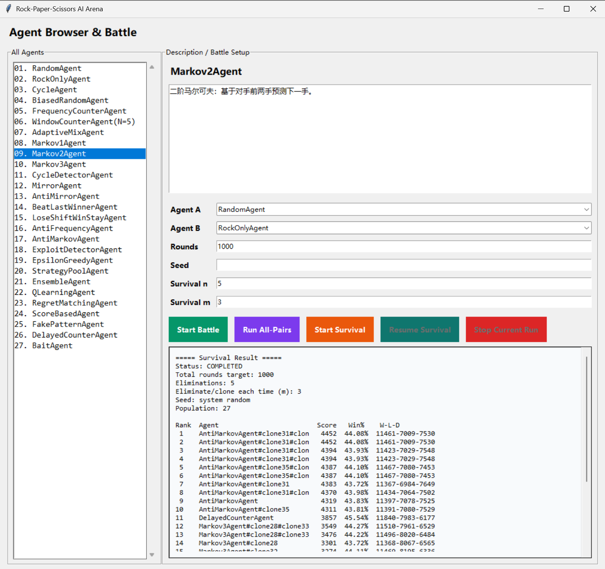
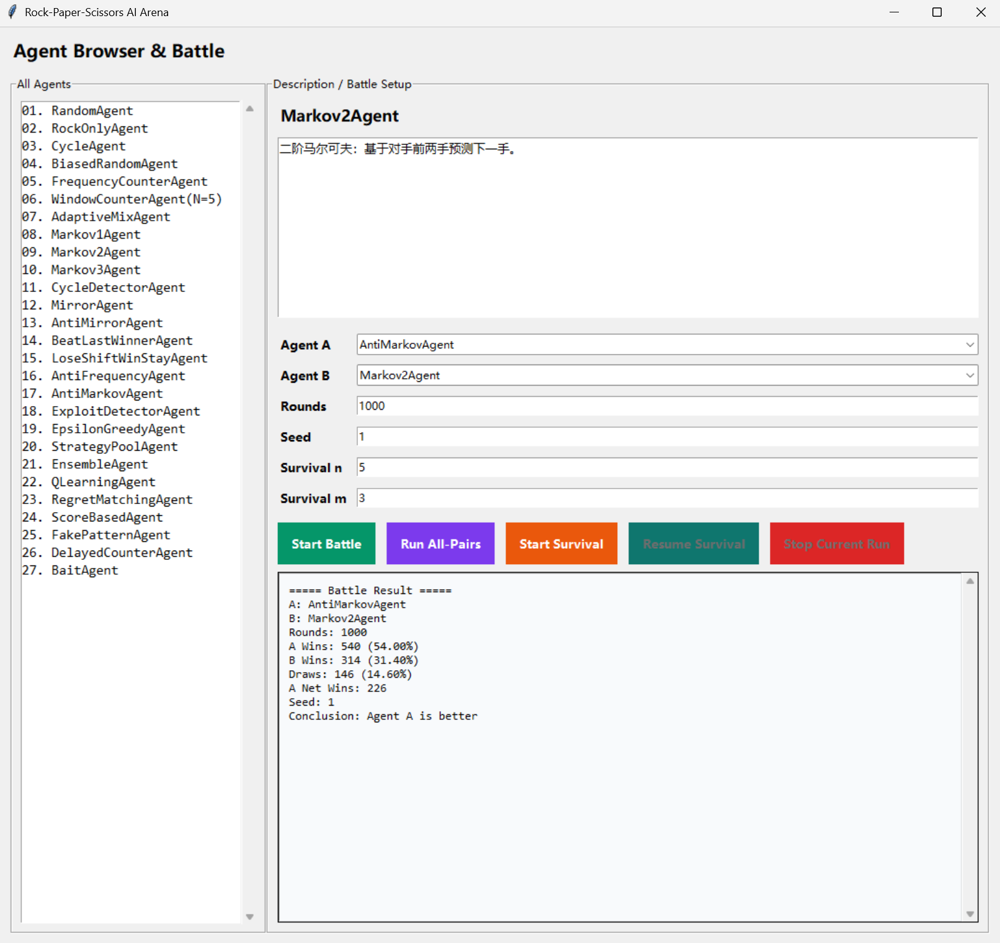

# Rock–Paper–Scissors Strategy Arena

一个基于 Python + Tkinter 的“石头剪刀布”策略竞技项目，用于比较不同 AI Agent 的博弈表现。项目内置多种策略体，支持单场对战、全量两两对战和生存淘汰赛，适合用于策略实验、教学演示和玩法验证。

生存模式实例图


两个agent对战实例图

## 功能特性

- 可视化界面：内置 Agent 控制台，可查看每个策略的说明并快速配置对战参数。
- 单场对战（1v1）：选择 Agent A / Agent B，设置回合数与随机种子，输出胜负、胜率、平局率等结果。
- 全量两两对战（All-Pairs）：自动遍历全部 Agent 的组合并行跑分，生成排行榜。
- 生存模式（Survival）：按阶段进行群体对战，每阶段淘汰末尾并克隆头部策略（保留策略记忆状态），观察长期演化表现。
- 运行控制：支持停止当前长任务；生存模式支持暂停后继续（Resume）。
- 可复现性：支持 Seed，便于对实验结果复现与对比。

## 项目结构

```text
Rock–Paper–Scissors/
├─ main.py                # Tkinter GUI 入口，包含单场/全量/生存模式逻辑
├─ game.py                # 对局执行与计分核心（run_match / judge_round）
├─ agent.py               # Agent 抽象接口与回合上下文定义
├─ agents/                # 各策略 Agent 实现与注册
├─ requirements.txt       # 依赖说明（当前仅标准库）
└─ agent.md               # 策略设计笔记（项目文档）
```

## 内置策略（摘要）

项目当前提供 27 个 Agent，覆盖以下类别：

- Baseline：`RandomAgent`、`RockOnlyAgent`、`CycleAgent`、`BiasedRandomAgent`
- 统计/频率类：`FrequencyCounterAgent`、`WindowCounterAgent`、`AdaptiveMixAgent`
- 序列建模类：`Markov1Agent`、`Markov2Agent`、`Markov3Agent`、`CycleDetectorAgent`
- 对抗/心理类：`MirrorAgent`、`AntiMirrorAgent`、`BeatLastWinnerAgent`、`LoseShiftWinStayAgent`
- 反制/元策略：`AntiFrequencyAgent`、`AntiMarkovAgent`、`ExploitDetectorAgent`
- 组合与学习类：`EpsilonGreedyAgent`、`StrategyPoolAgent`、`EnsembleAgent`、`QLearningAgent`、`RegretMatchingAgent`、`ScoreBasedAgent`
- 诱导与延迟类：`FakePatternAgent`、`DelayedCounterAgent`、`BaitAgent`

## 环境要求

- Python 3.10+
- 操作系统：Windows / macOS / Linux（需系统可用 Tkinter）

> 本项目当前仅使用 Python 标准库；`requirements.txt` 保留用于常规 `pip install -r requirements.txt` 工作流。

## 安装与运行

```bash
pip install -r requirements.txt
python main.py
```

运行后流程：

1. 进入首页并点击 `Enter Agent Browser & Battle`
2. 在右侧配置 Agent、Rounds、Seed
3. 选择运行模式：`Start Battle` / `Run All-Pairs` / `Start Survival`

## 参数说明

- `Rounds`：总回合数（正整数）
- `Seed`：随机种子（可留空，留空则使用系统随机）
- `Survival n`：生存模式阶段数（正整数）
- `Survival m`：每阶段淘汰与克隆数量（正整数）

生存模式约束：

- Agent 总数必须 `> 2*m`
- `Rounds >= n`

## 结果解读

- 单场对战：展示双方胜场、胜率、净胜场与结论。
- 全量两两对战：按综合表现输出排行榜，并给出 Win/Loss/Draw 比率。
- 生存模式：按 `score` 与战绩排序，展示阶段演化后的群体排名。

## 可扩展性

新增策略时，只需：

1. 在 `agents/` 下新增 Agent 类（继承 `Agent` 并实现 `next_move`）
2. 在 `agents/__init__.py` 中注册到 `AVAILABLE_AGENTS`
3. （可选）补充 `AGENT_DESCRIPTIONS` 说明文本
